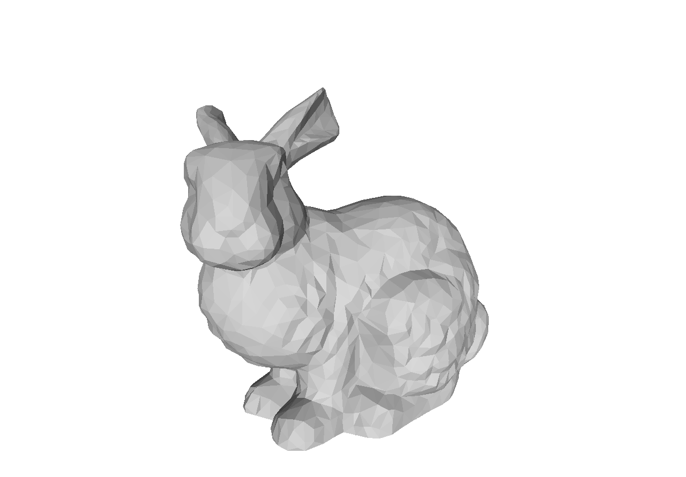

# MVC Cloning and Mesh Simplification
## MVC Cloning
### Usage
```
.\mvc --src [SRC_PATCH] --dst [DST_PATCH] --out [OUT_FILENAME] --mask [MASK_FILE] --interactive --x [X_POS] --y [Y_POS]
```
When `--interactive` is present, interactive mode is on, where you can create mask/ select the destination position of patch via GUI, otherwise in CLI mode you need to specify `--x` and `--y` position. 
Note that you do not need to create mask if you've specified mask file through `--mask`.
### Demo


## Mesh Simplification
Based on Quadric Error Metrics
### Usage
```
.\main --src [SRC_OBJ_FILE] --dst [OUTPUT_OBJ_FILE] --ratio [SIMPLIFICATION_RATIO]
```
Note the simplification ratio is based on vertex numbers. But in our experiments we found it applicable to triangular face numbers too.  
***We only support OBJ model and the handling of vertex normals, which means vertex texture info would be dropped during simplification, yet you can implement this by simply adding two dimensions to the Q matrix.***
### Demo


## References
1. Farbman, Zeev, Gil Hoffer, Yaron Lipman, Daniel Cohen-Or, and Dani Lischinski. "Coordinates for instant image cloning." ACM Transactions on Graphics (TOG) 28, no. 3 (2009): 67.
2. Garland, Michael, and Paul S. Heckbert. "Surface simplification using quadric error metrics." In Proceedings of the 24th annual conference on Computer graphics and interactive techniques, pp. 209-216. ACM Press/Addison-Wesley Publishing Co., 1997.
3. Garland, Michael, and Paul S. Heckbert. "Simplifying surfaces with color and texture using quadric error metrics." In Proceedings Visualization'98 (Cat. No. 98CB36276), pp. 263-269. IEEE, 1998.
